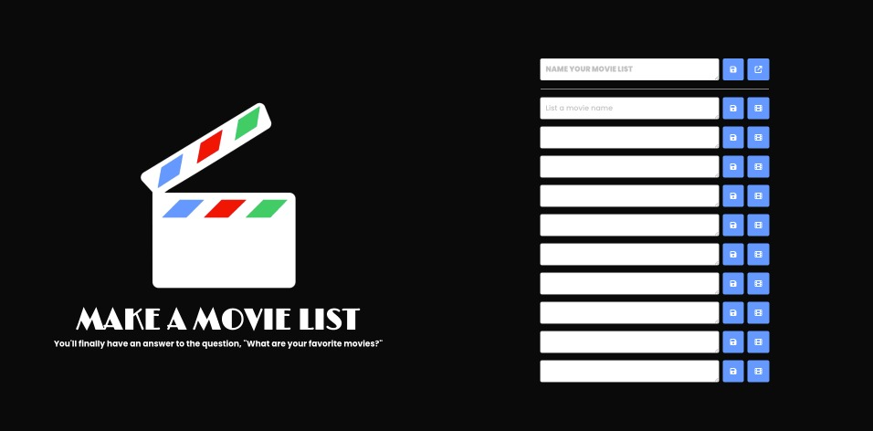
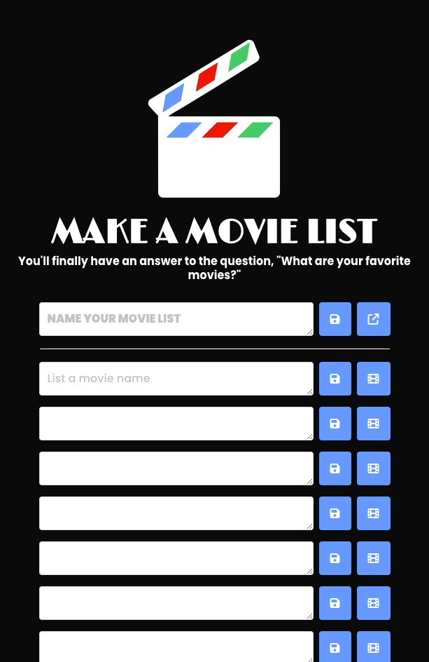

# Make a Movie List
An top ten movie list generator built using HTML, CSS, JavaScript, and APIs

## Usage
When a user enters the name of a movie into the list, they are able to save it into the browser’s local storage by clicking the "save" button. Then, the option to view more information about the saved movie is available by clicking the "movie" button. 

## Links
[**Make a Movie List**](https://mbartnett.github.io/Make-a-Movie-List/) 
[**Make a Movie List Repo**](https://github.com/mbartnett/Make-a-Movie-List)

## Screengrabs

## Acknowledgments
Many thanks to our T.A. Jason and to the rest of the teaching staff for all their help along the way!

## License
Please refer to the LICENSE in the repo.